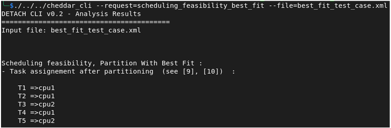

# Task Placement Algorithm: Rate-Monotonic Best Fit

### Description


Tasks are sorted in non-decreasing order of periods. The first task is placed on the first processor. For the second task, the function checks all processors, whether they meet the **IP Condition**. For processors that satisfy the condition, the algorithm checks the number k<sub>j</sub> of tasks already assigned to each processor j, and computes U<sub>j</sub>, the total utilization of the k<sub>j</sub> tasks. And the task is assigned to the processor that has the smallest value of the **Formula**. If the condition is not met, a new processor is selected for the task. 

**IP Condition :**

$$
C_m / T_m \le 2(1 + u / (m-1))^{-(m-1)} -1
$$

<sub style="text-align:bottom;">u <sub>: CPU utilization of already assigned tasks</sub></sub>

<sub style="text-align:bottom;">m <sub>: latest task to be added</sub></sub>

**Formula :**

$$
2(1 + U_j/k_j)^{-k_j} - 1
$$

<sub>k<sub>j</sub> <sub>: number of already affected tasks to cpu j</sub></sub>

<sub>U<sub>j</sub> <sub>: utilization of already affected tasks to cpu j</sub></sub>
### Example Setup

System with 2 processors **cpu1 , cpu2**

| Task | Capacity | Period | Utilization |
|------|----------| ------ | ----------- |
| T1   | 1        | 4 | 0.25 |
| T2   | 1        | 5 | 0.20 |
| T3   | 4        | 10 | 0.40 |
| T4   | 3        | 12 | 0.25 |
| T5   | 2        | 15 | 0.13 |


### Allocation Process

<sub>Tasks sorted by increasing periods:</sub>
<sub>**T1 → T2 → T3 → T4 → T5**<sub>

### step 1: adding T1 to cpu1
$$
 cpu1 : { T1 }
$$

### step 2: adding T2 to cpu1

$U_{\text{cpu1}} = 0.45 \le n \left(2^{\frac{1}{n}} - 1\right) \simeq 0.82$

$C_m / T_m \le 2(1 + u / (m-1))^{-(m-1)} -1 => 0.20 \le 0.6 => True$

<sub> since we have only one cpu that has tasks we add **T2** to **cpu1** :</sub> 

$$
 cpu1 : { T1 , T2 }
$$ 


### step 3: adding T3 to cpu2

$U_{\text{cpu1}} = 0.85 \le n \left(2^{\frac{1}{n}} - 1\right) \simeq 0.77$

$C_m / T_m \le 2(1 + u / (m-1))^{-(m-1)} -1 => 0.40 \le 0.23 => False
$

<sub>we can't  add T3 to cpu1 because utilization factor doesn't satisfy the Utilization Condition and IP condition not satisfied, so we add **T3** to **cpu2** : </sub>

$$
 cpu2 : { T3 }
$$ 


### step 4: adding T4 to cpu1

<sub>now we have two processors to check :</sub>

$U_{\text{cpu1}} = 0.70 \le n \left(2^{\frac{1}{n}} - 1\right) \simeq 0.77 => True$

$_m / T_m \le 2(1 + u_{\text{cpu1}} / (m-1))^{-(m-1)} -1 => 0.25 \le 0.33 => True$

 ---

$U_{\text{cpu2}} = 0.65 \le n \left(2^{\frac{1}{n}} - 1\right) \simeq 0.82 => True$

$C_m / T_m \le 2(1 + u_{\text{cpu2}} / (m-1))^{-(m-1)} -1 => 0.25 \le 0.42 => True$

**Calculate Formula :**

$2(1 + U_{\text{cpu1}}/k_{\text{cpu1}})^{-k_{\text{cpu1}}} - 1 \simeq 0.63 < 2 (1 + U_{\text{cpu2}}/k_{\text{cpu2}})^{-k_{\text{cpu2}}} - 1 = 1$


<sub> we add **T4** to **cpu1** : </sub> 

$$
 cpu1 : { T1 , T2 , T4 }
$$

### step 5: adding T5 to cpu2

$U_{\text{cpu1}} = 0.83 \le n \left(2^{\frac{1}{n}} - 1\right) \simeq 0.75 => False$

----

$U_{\text{cpu2}} = 0.53 \le n \left(2^{\frac{1}{n}} - 1\right) \simeq 0.82 => True$

$C_m / T_m \le 2(1 + u_{\text{cpu2}} / (m-1))^{-(m-1)} -1 => 0.13 \le 0.42 => True$


<sub> we add **T5** to **cpu2** because we exceed the utilization factor on cpu1</sub> 

$$
 cpu2 : { T3 , T5 }
$$ 


### Final Allocation

**cpu1 : { T1 , T2 , T4 }**

**cpu2 : { T3 , T5 }**

### Cheddar CLI


```
/cheddar_cli \ 
--request=scheduling_feasibility_best_fit \
--file=best_fit_test_case.xml 
```


[Download XML](./xmls/best_fit_test_case.xml)