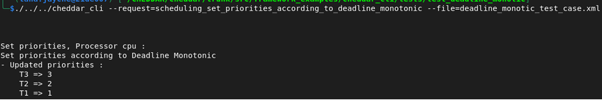

# Deadline Monotonic Scheduling

## Description

Deadline Monotonic is a fixed-priority scheduling algorithm where priorities are assigned based on task deadlines.

> "The shorter the deadline, the higher the priority."

## Task Set

| Task | Deadline |
|------|----------|
| T1   | 15       |
| T2   | 5        |
| T3   | 4        |

## Priority Assignment

After applying the Deadline Monotonic policy:

- T3 → Highest priority
- T2 → Medium priority
- T1 → Lowest priority

## Expected Results

| Task | Priority |
|------|----------|
| T1   | 1        |
| T2   | 2        |
| T3   | 3        |

## Cheddar CLI


```
/cheddar_cli \ 
--request=scheduling_set_priorities_according_to_deadline_monotonic \
-file=deadline_monotic_test_case.xml 
```


[Download XML](./xmls/deadline_monotic_test_case.xml)


