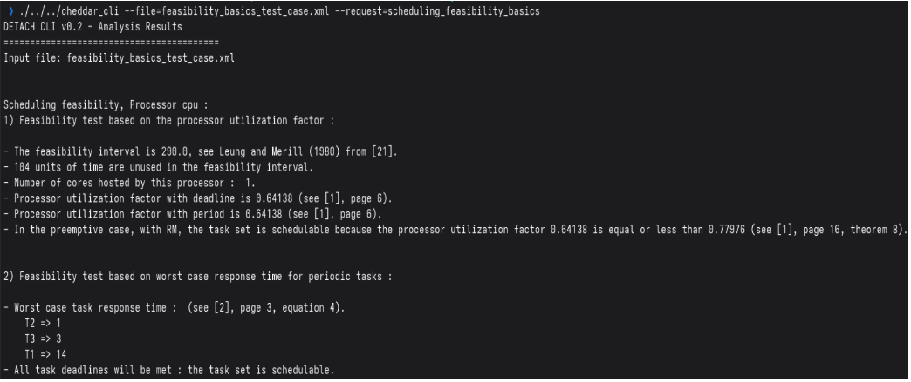

# Task Placement Algorithm: Basic Feasibility Tests

### Description

A basic feasibility test checks whether a set of real-time tasks can meet all deadlines.It mainly uses two methods: Utilization Test and Response Time Analysis .

*   Utilization Test :

$\forall i : D_i = P_i : \sum_{i=1}^{n} \frac{C_i}{P_i} \le n(2^{(1/n)} - 1)$

---------
*   Response Time Analysis :

$w_i^{n+1} = C_i + \sum_{j \in hp(i)} \left\lceil \frac{w_i^n}{P_j} \right\rceil C_j$

### **Calculation Rules**

1.  **Initial Value**: Start the iteration with the task's own execution time: $w_i^0 = C_i$
2.  **Success Condition**: The calculation is successful when the value converges (the response time stops changing):$w_i^{n+1} = w_i^n$
3.  **Failure Condition**: The task is not schedulable if the calculated time exceeds its period (where $D_i = P_i$): $w_i^n > P_i$


## Example Setup

| Task | Capacity | Period/Deadline |
|------|----------| ------ |
| T1   | 7        | 29 |
| T2   | 1        | 5 |
| T3   | 2        | 10 |

## Utilization Test :

$\frac{2}{10} + \frac{1}{5} + \frac{7}{29} = 0.64137931 
\le 3 \left( 2^{\frac{1}{3}} - 1 \right) = 0.77976315$

Therefore, the tasks are schedulable.

## analysis interval  :

- $\mathrm{ppcm}(29, 5, 10) = 290$

analysis interval is **290**

## Response Time Analysis  :

**T2 Reponse Time :**
$w_2^{0} = 1 => r_2 = 1$

**T3 Reponse Time :**

$w_3^{(0)} = 2$

$w_3^{(1)} = 2 + \left\lceil \frac{2}{5} \right\rceil \cdot 1 = 3$

$w_3^{(2)} = 2 + \left\lceil \frac{3}{5} \right\rceil \cdot 1 = 3 => r_3 = 3$

**T1 Reponse Time :**

$w_1^{(0)} = 7$

$w_1^{(1)} = 7 + \left\lceil \frac{7}{5} \right\rceil \cdot 1 + \left\lceil \frac{7}{10} \right\rceil \cdot 2 = 11$

$w_1^{(2)} = 7 + \left\lceil \frac{11}{5} \right\rceil \cdot 1 + \left\lceil \frac{11}{10} \right\rceil \cdot 2 = 14$

$w_1^{(3)} = 7 + \left\lceil \frac{14}{5} \right\rceil \cdot 1 + \left\lceil \frac{14}{10} \right\rceil \cdot 2 = 14 => r_1 = 14$

### Cheddar CLI

```
/cheddar_cli \ 
--request=scheduling_feasibility_basics \
--file=feasibility_basics_test_case.xml 
```


[Download XML](./xmls/feasibility_basics_test_case.xml)