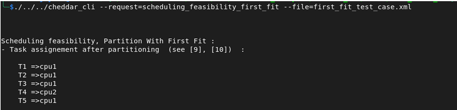

# Task Placement Algorithm: Rate-Monotonic First Fit

## Description

To overcome this waste of processor of (RMNF)
utilization, the RMFF Algorithm always starts to check the schedulability of a task on processors
with lower indexes, i.e., those processors on which some tasks have been assigned. 

**IP Condition :**

$$
C_m / T_m \le 2(1 + u / (m-1))^{-(m-1)} -1
$$

<sub style="text-align:bottom;">u <sub>: CPU utilization of already assigned tasks</sub></sub>

<sub style="text-align:bottom;">m <sub>: latest task to be added</sub></sub>

## Example Setup

System with 2 processors **cpu1 , cpu2**

| Task | Capacity | Period | Utilization |
|------|----------| ------ | ----------- |
| T1   | 1        | 4 | 0.25 |
| T2   | 1        | 5 | 0.20 |
| T3   | 2        | 10 | 0.20 |
| T4   | 3        | 12 | 0.25 |
| T5   | 2        | 20 | 0.1 |


### Allocation Process

<sub>Tasks sorted by increasing periods:</sub>
<sub>**T1 → T2 → T3 → T4 → T5**<sub>

### step 1: adding T1 to cpu1
<p style="text-align:center;"> <strong>cpu1 : { T1 }</strong> </p>
### step 2: adding T2 to cpu1

$U_{\text{cpu1}} = 0.45 \le n \left(2^{\frac{1}{n}} - 1\right) \simeq 0.82 => True$


$C_m / T_m \le 2(1 + u_{\text{cpu1}} / (m-1))^{-(m-1)} -1 => 0.20 \le 0.6 => True$

<sub>we add T2 to **cpu1** :</sub>

<p style="text-align:center;"> <strong>cpu1 : {T1 , T2}</strong> </p>

### step 3: adding T3 to cpu1

$U_{\text{cpu1}} = 0.65 \le n \left(2^{\frac{1}{n}} - 1\right) \simeq 0.77 => True$

$C_m / T_m \le 2(1 + u_{\text{cpu1}} / (m-1))^{-(m-1)} -1 => 0.20 \le 0.33 => True$

<sub>we add T3 to **cpu1** :</sub>

<p style="text-align:center;"> <strong>cpu1 : {T1 , T2 , T3}</strong> </p>


### step 4: adding T4 to cpu2

$U_{\text{cpu1}} = 0.90 \le n \left(2^{\frac{1}{n}} - 1\right) \simeq 0.75 => False$

<sub>we can't add T4 to cpu1 so we pass to the next cpu and we add it to it :</sub>

<p style="text-align:center;"> <strong>cpu2 : { T4 }</strong> </p>

### step 5: adding T5 to cpu1

$U_{\text{cpu1}} = 0.75 \le n \left(2^{\frac{1}{n}} - 1\right) \simeq 0.75 => True$

$C_m / T_m \le 2(1 + u_{\text{cpu1}} / (m-1))^{-(m-1)} -1 => 0.1 \le 0.11 => True$

<sub>we add T5 to **cpu1** :</sub>

<p style="text-align:center;"> <strong>cpu1 : {T1 , T2 , T3 , T5}</strong> </p>

## Final Allocation

**cpu1 : { T1 , T2 , T3 , T5}**

**cpu2 : { T4 }**

## Cheddar CLI

```
/cheddar_cli \ 
--request=scheduling_feasibility_first_fit \
--file=first_fit_test_case.xml 
```


[Download XML](./xmls/first_fit_test_case.xml)