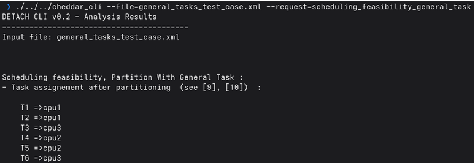

# Task Placement Algorithm: Rate-Monotonic General-Tasks

### Description


**(1)** Partition the set of tasks into two groups:

$\mathcal{G}_1 = \{ \tau_i \mid U_i \le 1/3 \}$
$\mathcal{G}_2 = \{ \tau_i \mid U_i > 1/3 \}$

**(2)** Use the RMST scheme in Algorithm 1 to assign the task set $\mathcal{G}_1$.

**(3)** Assign tasks in $\mathcal{G}_2$ as follows:

*   **(3.1)** Set the task index to $i := 1$ and assign $\tau_1$ to an empty processor with index 1.

*   Set $\rho_1 := U_1$.
*   **(3.2)** Increase the task index to $i := i + 1$ and consider task $\tau_i$.

*   Use a first-fit heuristic to find a processor $n$ that contains a task $\tau_j$ such that:

    $\lfloor \frac{T_j}{T_i} \rfloor (T_j - C_i) \ge C_j \quad \text{or} \quad T_j \ge \lceil \frac{T_j}{T_i} \rceil C_i + C_j$

    if $T_i < T_j$, and
    
    $\lfloor \frac{T_i}{T_j} \rfloor (T_i - C_j) \ge C_i \quad \text{or} \quad T_i \ge \lceil \frac{T_i}{T_j} \rceil C_j + C_i$

    if $T_i \ge T_j$.

    
    
    If such a processor exists, assign task $\tau_i$ to processor $n$ by setting $\rho_n := \rho_n + U_i$.

    Otherwise, assign task $\tau_i$ to an empty processor with index $m$, and set $\rho_m := U_i$.

    Continue with step **(3.2)**.

*   **(3.3)** Terminate when all tasks in $\mathcal{G}_2$ have been assigned.


## Example Setup

| Task | Capacity | Period | Utilization | S<sub>i</sub> |
|------|----------| ------ | ----------- | ------------- |
| T1   | 1        | 4 | 0.25 | 2 |
| T2   | 1        | 5 | 0.20 | 2.322 |
| T3   | 4        | 10 | 0.40 | --- |
| T4   | 3        | 12 | 0.25 | 3.585 |
| T5   | 2        | 15 | 0.13 | 3.907 |
| T6   | 8        | 20 | 0.4 | --- |


## Allocation Process

$\mathcal{G}_1 = \{ T1 , T2 , T4 , T5  \}$ , $\mathcal{G}_2 = \{ T3 , T6 \}$

### For G1 use RMST

**CPU1 : {T1 , T2 }** , **CPU2 : { T4 , T5 }** 

### For G2 :

#### step 1: Add T3 to a new processor

<sub>Adding T3 to cpu<sub>3</sub></sub>

**P3 : { T3 }**

#### step2 :Adding T6 cpu3

<sub>Use a first-fit heuristic</sub>

**cpu3**

------

<sub> in cpu3 we have T3 </sub>

since $T_6 \gt T_3$ we calculate the condition

$\lfloor \frac{T_i}{T_j} \rfloor (T_i - C_j) \ge C_i \quad \text{or} \quad T_i \ge \lceil \frac{T_i}{T_j} \rceil C_j + C_i$

$20 \ge \lceil \frac{20}{10} \rceil 4 + 8 => 20 \ge 16 => True$


<sub> we add T6 to cpu3 </sub>

**CPU3 : { T3 , T6 }** 


------

### Cheddar CLI
```
/cheddar_cli \ 
--request=scheduling_feasibility_general_task \
--file=general_tasks_test_case.xml 
```



[Download XML](./xmls/general_tasks_test_case.xml)