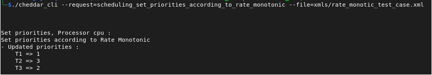

# Rate Monotonic Scheduling

## Description

Rate Monotonic is a fixed-priority scheduling algorithm where priorities are assigned based on the task period.

> "The shorter the task period, the more important the task."

## Task Set

| Task | Period |
|------|--------|
| T1   | 29     |
| T2   | 5      |
| T3   | 10     |

## Priority Assignment

After applying the Rate Monotonic policy:

- T2 → Highest priority
- T3 → Medium priority
- T1 → Lowest priority

## Expected Results

| Task | Priority |
|------|----------|
| T1   | 1        |
| T2   | 3        |
| T3   | 2        |

## Cheddar CLI

```
/cheddar_cli \ 
--request=scheduling_set_priorities_according_to_rate_monotonic \
-file=rate_monotic_test_case.xml 
```




[Download XML](./xmls/rate_monotic_test_case.xml)
