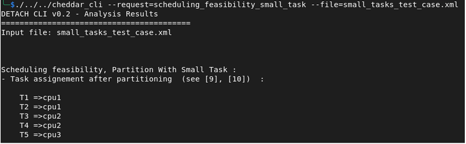

# Task Placement Algorithm: Rate-Monotonic Small-Tasks 

### Description

**(1)**  Order the task set such that $0 \le S_1 \le \dots \le S_K < 1$ and set $S_{K+1} := S_1 + 1$. 
    Set the task index to $i := 1$, and the processor index to $n = 0$.

**(2)**  Select an empty processor with index $n := n + 1$. Assign task $\tau_i$ to processor $n$, 
    that is $\rho_n := U_i$. Set $S := S_i$, and $\tilde{\beta}_n := 0$.

**(3)**  Increase the task index, $i := i + 1$, and set $\tilde{\beta}_n := S_i - S$. If the schedulability condition

$$
U_i + C_n / T_n  \le  \max\{\ln 2, 1 - \tilde{\beta} \ln 2\}
$$

is satisfied, assign task $\tau_i$ to processor $n$ by setting $\rho_n := \rho_n + U_i$, and continue with step **(3)**  . 
Otherwise, continue with step **(2)**  .

**(4)**  When all tasks have been assigned set $\tilde{\beta}_n := S_{K+1} - S$ and terminate.


## Example Setup

| Task | Capacity | Period | Utilization | S<sub>i</sub> |
|------|----------| ------ | ----------- | ------------- |
| T1   | 1        | 4 | 0.25 | 2 |
| T2   | 1        | 5 | 0.20 | 2.322 |
| T3   | 4        | 10 | 0.40 | 3.322 |
| T4   | 3        | 12 | 0.25 | 3.585 |
| T5   | 2        | 15 | 0.13 | 3.907 |

## Allocation Process

<sub>Tasks sorted by increasing S<sub>i</sub>:</sub>
<sub>**T1 → T2 → T3 → T4 → T5**<sub>


### step 1: adding T1 to cpu1

$$
cpu1 : { T1 }
$$

$$
S = S_1 = 2
$$

### step 2: adding T2 to cpu1

$\tilde{\beta}_n = S_2 - S = 0.322$
 
$U_\text{cpu1} + C_2 / T_2  \le  \max\{\ln 2, 1 - 0.322 . \ln 2\}$

$=> 0.45 \le \max\{\ln 2, 0.77\} => 0.45 \le 0.77 => True$


<sub>we add T2 to **cpu1** :</sub>

$$
cpu1 : { T1 , T2 }
$$

### step 3: adding T3 to the next cpu (cpu2)

$\tilde{\beta}_n = S_3 - S = 1.322$

$U_\text{cpu1} + C_3 / T_2  \le  \max\{\ln 2, 1 - 1.322 . \ln 2\}$

$=> 0.85 \le \max\{\ln 2, 0.08\} => 0.85 \le 069 => False$

<sub>we add T3 to cpu2 and change value of **S** </sub>

$$
S = S_3 = 3.322
$$

### step 4: adding T4 to cpu2

$\tilde{\beta}_n = S_4 - S = 0.263$

$U_\text{cpu2} + C_4 / T_4  \le  \max\{\ln 2, 1 - 0.263. \ln 2\}$

$=> 0.65 \le \max\{\ln 2, 0.77\} => 0.65 \le 0.69 => True$

<sub>we add T4 to **cpu2** </sub>

### step 4: adding T4 to the next cpu (cpu3)

$\tilde{\beta}_n = S_5 - S = 0.585$

$U_\text{cpu2} + C_5 / T_5  \le  \max\{\ln 2, 1 - 0.585. \ln 2\}$

$=> 0.78 \le \max\{\ln 2, 0.59\} => 0.78 \le 0.69 => False$

<sub>we add T5 to **cpu3** </sub>

## Final Allocation

**cpu1 : { T1 , T2 }**

**cpu2 : { T3 , T4 }**

**cpu3 : {T5}**


### Cheddar CLI

```
/cheddar_cli \ 
--request=scheduling_feasibility_small_task \
--file=small_tasks_test_case.xml 
```



[Download XML](./xmls/small_tasks_test_case.xml)